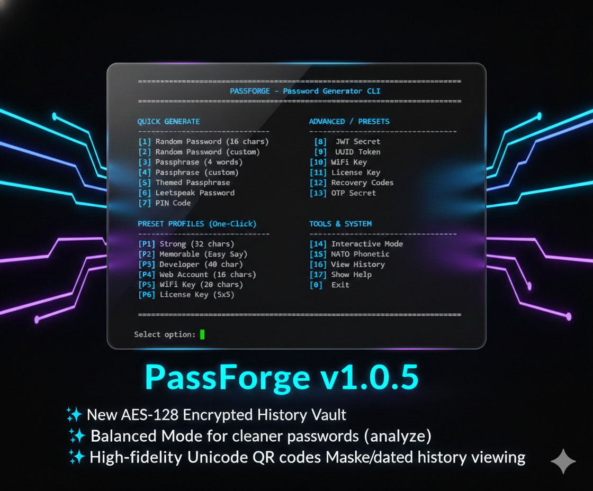
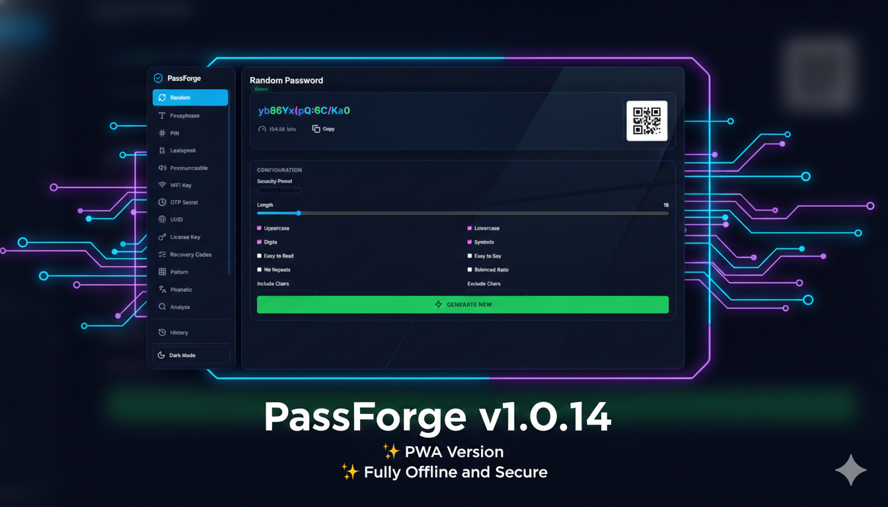

# PassForge - All-in-One Password Generator CLI

A production-ready, cryptographically secure password generator CLI with 17 generation modes, entropy transparency, and comprehensive customization options.





## Features

### 17 Generation Modes

| Generator | Command | Description |
|-----------|---------|-------------|
| **Random** | `random`, `r` | Cryptographically secure random character passwords |
| **Passphrase** | `phrase`, `p` | Word-based passphrases using EFF wordlist |
| **Leetspeak** | `leet`, `l` | Passphrases with character substitution (A→4, E→3, etc.) |
| **PIN** | `pin` | Numeric PINs of configurable length |
| **Pronounceable** | `pronounce`, `pr` | Easy-to-speak syllable-based passwords |
| **UUID** | `uuid`, `u` | RFC 4122/9562 UUIDs (v1, v4, v7) & Short (Base58) |
| **Base64** | `base64`, `b64` | URL-safe base64-encoded secrets |
| **JWT Secret** | `jwt` | High-entropy secrets for JWT signing (HS256/384/512) |
| **WiFi Key** | `wifi` | WPA2/WPA3 compatible keys (8-63 chars) |
| **License Key** | `license` | Software license keys (AXB format, e.g. 5x5) |
| **Recovery Codes** | `recovery` | 2FA backup codes (numeric or word-based) |
| **OTP Code/Secret** | `otp` | TOTP/HOTP codes & secrets with otpauth URI |
| **Pattern** | `pattern` | Visual grid-based pattern passwords |
| **Themed Phrase** | `phrase` (custom) | Passphrases from themed wordlists (animals, sci-fi, etc.) |
| **NATO Phonetic** | `phonetic`, `ph` | Convert text/passwords to NATO alphabet (Alpha-Bravo) |
| **Analyze** | `analyze`, `check` | Analyze strength of an existing password |
| **History** | `history` | View password generation history (defaults to 10 entries) |

- **Preset Profiles**: One-click generation for common use cases (Strong, Memorable, Dev, etc.)
- **Interactive Menu**: Full-featured menu for guided generation
- **Platform Launchers**: Dedicated `.bat` and `.sh` scripts with interactive menus
- **Cryptographic Security**: Uses Python's `secrets` module for CSPRNG
- **Entropy Transparency**: Real-time entropy calculation and strength analysis
- **zxcvbn Analysis**: Pattern-based password strength checking (dictionary attacks, sequences)
- **Secure Clipboard**: Auto-wipe clipboard after configurable timeout
- **Live OTP Codes**: Generates current 6/8 digit TOTP codes alongside the secret
- **QR Codes for OTP**: Scannable QR codes for authenticator apps
- **Color-Coded Output**: Visual distinction between character types
- **JSON Export**: Machine-readable output for scripting
- **Balanced Mode**: Ensures readable distribution (60% Letters, 20% Digits, 20% Symbols)
- [**Generator Guide**](LITERATURE.md): Comprehensive documentation for all 14 generator types.
- **Encrypted History (Vault)**: Automatically encrypts saved passwords using AES-128 (Fernet).
- **Secure Vault Storage**: Dedicated vault handles cryptographic keys via `.env` (recommended) or legacy `.vault.key` with strict 0600 file permissions
- **Zero-Leakage Architecture**: 🛡️ Source code and logs are blocked from browser access in PWA mode; sensitive inputs are masked in CLI mode for entropy analysis.
- **Redacted Exports**: Security-first history export with automatic password redaction by default
- **Zero-Indentation UI**: Clean, professional left-aligned output for all modes
- **Smart Leetspeak**: Probabilistic substitution for more natural, readable passwords
- **Robust Validation**: Interactive prompts with default values and recursive error handling
- **Defensive PWA Frontend**: 🛡️ Built-in safety checks for CDN assets to prevent initialization crashes.
- **Global Modifiers**: `--easy-read` and `--easy-say` modes
- **Paranoid Mode**: Optional manual entropy collection via keyboard timing jitter for maximum security.

## Installation

```bash
# Clone the repository
git clone https://github.com/krishnakanthb13/password_generator.git
cd password_generator

# Install dependencies (colorama, cryptography, pyperclip, etc.)
pip install -r requirements.txt
```

## Quick Start

```bash
# Generate a 20-character random password
python main.py random -l 20

# Generate a 4-word passphrase
python main.py phrase -w 4 --capitalize

# Generate a leetspeak passphrase
python main.py leet -w 3 -s _

# Generate with entropy analysis
python main.py --show-entropy random -l 16

# Launch interactive mode
python main.py --interactive

# Use a preset profile (Strong)
python main.py --preset strong --show-entropy
```

## Usage Examples

### Random Passwords

```bash
# Basic 16-character password
python main.py random

# 24-character, letters only
python main.py random -l 24 --no-symbols --no-digits

# Easy to read (no 0/O, 1/l/I)
python main.py --easy-read random -l 20

# With minimum requirements
python main.py random -l 16 --min-upper 2 --min-digits 2 --min-symbols 1

# Balanced mode (mostly letters, fewer symbols)
python main.py random -l 24 --balanced
```

### Passphrases

```bash
# Standard 4-word passphrase
python main.py phrase -w 4

# Capitalized with underscore separator
python main.py phrase -w 5 -s _ --capitalize

# Alternate case (High Entropy)
python main.py phrase -w 4 -s . --alternate
# Output: aPpLe.bAnAnA.cHeRrY.dAtE

# Uppercase with hyphen separator (High Entropy)
python main.py phrase -w 4 -s . --uppercase
# Output: APPLE-BANANA-CHERRY-DATE

# Leetspeak version (Smart 50% substitution)
python main.py leet -w 4 -s -
# Output: 4PPl3.8@N@N@.c3rrY.d4t3

# Themed Passphrase (using 'animals.txt')
python main.py phrase -w 4 --capitalize --wordlist data/wordlists/animals.txt
# Output: Tiger-Falcon-Shark-Wolf
```

### Software Keys (A x B)

```bash
# 5 segments of 5 characters
python main.py license --segments 5 --segment-length 5

# 4 segments of 8 characters
python main.py license --segments 4 --segment-length 8
```

### Developer Tokens

```bash
# JWT secret for HS256
python main.py jwt --bits 256

# Base64 API key
python main.py base64 -b 32 --url-safe

# UUID token (v4 Random)
python main.py uuid --upper

# UUID v7 (Time-based, sortable)
python main.py uuid --ver 7
# Or shortcut
python main.py uuid --v7

# Short UUID (Base58 encoded, ~22 chars)
python main.py uuid --short

# Generate a v7 UUID using the shortcut
python main.py u --v7

# Generate 10 short v4 UUIDs
python main.py uuid --v4 --short -n 10

# NATO Phonetic Conversion
python main.py phonetic --text "PassForge"
# Output: Papa-Alpha-Sierra-Sierra-Foxtrot-Oscar-Romeo-Golf-Echo
```

### Security & Logging

```bash
# Analyze an existing password
python main.py analyze "p@ssword123"

# Log to history
python main.py --log random -l 16

# View last 10 history entries (default)
python main.py history

# View all history entries (decrypted on the fly)
python main.py history --all

# View history with redacted passwords
python main.py history --redact

# Export history (Redacted by default)
python main.py history --export backup.json

# Export history (Plaintext - requires caution)
python main.py history --export secrets.csv --no-redact

# JSON output for scripts
python main.py --json jwt --bits 256
```

## Command Reference

| Flag | Description |
|------|-------------|
| `--preset` | Use a predefined security profile (strong, memorable, dev, pin, web, wifi, key) |
| `-i`, `--interactive` | Launch interactive menu mode |
| `--paranoid` | Enable Paranoid Mode (manual entropy collection) |
| `--json` | Output in JSON format |
| `--show-entropy` | Display entropy analysis (enabled by default in launchers) |
| `--check-strength` | Run zxcvbn pattern analysis |
| `-c`, `--clipboard` | Copy result to clipboard |
| `--confirm-copy` | Prompt to confirm copying result to clipboard |
| `--clipboard-timeout` | Auto-wipe clipboard after N seconds (default: 30) |
| `--log` | Log password to history (AES-128 encrypted) |
| `--no-color` | Disable colored output |
| `--easy-read` | Exclude ambiguous characters (0/O, 1/l/I) |
| `--easy-say` | Only pronounceable characters (no symbols) |

### Generator-Specific Options

#### Random (`random`, `r`)

| Flag | Default | Description |
|------|---------|-------------|
| `-l`, `--length` | 16 | Password length (8-128) |
| `--no-uppercase` | - | Exclude uppercase letters |
| `--no-lowercase` | - | Exclude lowercase letters |
| `--no-digits` | - | Exclude digits |
| `--no-symbols` | - | Exclude symbols |
| `--include` | - | Additional characters to include |
| `--exclude` | - | Characters to exclude |
| `--no-repeats` | - | No repeated characters |
| `--min-upper` | 0 | Minimum uppercase characters |
| `--min-lower` | 0 | Minimum lowercase characters |
| `--min-digits` | 0 | Minimum digits |
| `--min-symbols` | 0 | Minimum symbols |
| `--balanced` | - | Balanced ratio (60/20/20) |
| `-n`, `--count` | 1 | Number to generate |

#### Passphrase (`phrase`, `p`)

| Flag | Default | Description |
|------|---------|-------------|
| `-w`, `--words` | 4 | Number of words (2-12) |
| `-s`, `--separator` | `-` | Word separator |
| `--capitalize` | - | Capitalize each word |
| `--uppercase` | - | All words in uppercase |
| `--alternate` | - | Alternate case (aLtErNaTe) |
| `--wordlist` | - | Path to custom wordlist |
| `-n`, `--count` | 1 | Number to generate |

#### Leetspeak (`leet`, `l`)

| Flag | Default | Description |
|------|---------|-------------|
| `-w`, `--words` | 3 | Number of words (2-12) |
| `-s`, `--separator` | `-` | Word separator ( - _ . , ) |
| `-n`, `--count` | 1 | Number to generate |

#### PIN (`pin`)

| Flag | Default | Description |
|------|---------|-------------|
| `-l`, `--length` | 6 | PIN length (4-20) |
| `-n`, `--count` | 1 | Number to generate |

#### Pronounceable (`pronounce`, `pr`)

| Flag | Default | Description |
|------|---------|-------------|
| `-l`, `--length` | 12 | Password length |
| `-n`, `--count` | 1 | Number to generate |

#### UUID (`uuid`)

| Flag | Default | Description |
|------|---------|-------------|
| `--ver` | 4 | UUID Version (1, 4, 7) |
| `--short` | - | Short format (Base58) |
| `--upper` | - | Uppercase output (hex only) |
| `-n`, `--count` | 1 | Number to generate |

#### Base64 (`base64`, `b64`)

| Flag | Default | Description |
|------|---------|-------------|
| `-b`, `--bytes` | 32 | Number of random bytes |
| `--url-safe` | - | Use URL-safe characters |

#### JWT Secret (`jwt`)

| Flag | Default | Description |
|------|---------|-------------|
| `--bits` | 256 | Bit length (256, 384, 512) |
| `--hex` | - | Output as hex string |

#### WiFi Key (`wifi`)

| Flag | Default | Description |
|------|---------|-------------|
| `-l`, `--length` | 24 | Key length (8-63, default: 24) |
| `--simple` | - | Alphanumeric only (no symbols) |

#### License Key (`license`)

| Flag | Default | Description |
|------|---------|-------------|
| `--segments` | 4 | Number of segments (2-10) |
| `--segment-length` | 4 | Characters per segment (2-10) |

#### Recovery Codes (`recovery`)

| Flag | Default | Description |
|------|---------|-------------|
| `-n`, `--count` | 10 | Number of codes (5-20, default: 10) |
| `-l`, `--length` | 10 | Code length (digits or words, default: 10/3) |
| `--words` | - | Use word-based codes |

#### OTP Secret (`otp`)

| Flag | Default | Description |
|------|---------|-------------|
| `--digits` | 6 | Code length (6 or 8) |
| `--period` | 30 | Time period in seconds |
| `--qr` | - | Show QR code in terminal |

#### Pattern (`pattern`)

| Flag | Default | Description |
|------|---------|-------------|
| `--grid` | 3 | Grid size (e.g. 3x3) |

#### Phonetic (`phonetic`, `ph`)

| Flag | Default | Description |
|------|---------|-------------|
| `--text` | - | Text to convert to NATO alphabet |
| `-l`, `--length` | 8 | Random sequence length (4-64) |

#### History (`history`)

| Flag | Default | Description |
|------|---------|-------------|
| `--last` | 10 | Show last N entries (1-100, default: 10) |
| `--all`, `-a` | - | Show all history entries (overrides --last) |
| `--search` | - | Filter history by keyword |
| `--redact` | - | Redact passwords in terminal output |
| `--export` | - | Export history to file (JSON/CSV) |
| `--no-redact` | - | Do not redact passwords in export (Caution!) |
| `--clear` | - | Clear all history entries |

## Entropy Guide

PassForge provides a comprehensive **Entropy Report** including the raw character pool size, Shannon bits, and brute-force time estimates.

| Entropy (bits) | Strength | Use Case |
|----------------|----------|----------|
| < 28 | Very Weak | Never use |
| 28-36 | Weak | Low-security only |
| 36-60 | Reasonable | Standard accounts |
| 60-80 | Strong | Sensitive data |
| 80-128 | Very Strong | High-security systems |
| > 128 | Excellent | Critical infrastructure |

> **Note:** For a detailed explanation of each generator type, see [LITERATURE.md](LITERATURE.md).

## Project Structure

```
password_generator/
├── main.py                 # Entry point
├── requirements.txt        # Dependencies
├── src/
│   ├── __init__.py
│   ├── cli.py                # Argument parser & banner
│   ├── command_handler.py    # Command routing
│   ├── interactive.py        # Interactive menu
│   ├── generators/           # All password generators
│   │   ├── base.py           # Abstract base class
│   │   ├── random_password.py # Random password generator
│   │   ├── passphrase.py     # Passphrase generator
│   │   ├── leetspeak.py      # Leetspeak generator
│   │   ├── pin.py            # PIN generator
│   │   ├── pronounceable.py  # Pronounceable password generator
│   │   ├── uuid_token.py     # UUID token generator
│   │   ├── base64_secret.py  # Base64 secret generator
│   │   ├── jwt_secret.py     # JWT secret generator
│   │   ├── wifi_key.py       # WiFi key generator
│   │   ├── license_key.py    # License key generator
│   │   ├── recovery_codes.py # Recovery codes generator
│   │   ├── otp.py            # OTP generator
│   │   ├── pattern.py        # Pattern generator
│   │   └── phonetic.py       # NATO Phonetic generator
│   ├── security/
│   │   ├── entropy.py        # Entropy calculator
│   │   ├── strength_checker.py # zxcvbn integration
│   │   └── vault.py          # Secure history encryption
│   ├── output/
│   │   ├── formatter.py      # Color-coded output
│   │   ├── logger.py         # History logging
│   │   ├── clipboard.py      # Secure clipboard handling
│   │   └── qrcode_gen.py     # QR code generation for OTP
│   ├── config/
│   │   ├── loader.py         # YAML/JSON config loader
│   │   └── presets.py        # Predefined security profiles
├── data/
│   └── wordlists/            # Themed wordlists (animals.txt, biology.txt, etc.)
└── tests/
```

## Testing

```bash
# Run all tests
python -m pytest tests/ -v

# Run specific test class
python -m pytest tests/test_generators.py::TestRandomPasswordGenerator -v

# Run with coverage
python -m pytest tests/ --cov=src --cov-report=html
```

All 53 unit tests cover:
- All 15 specialized generator modes
- Entropy and zxcvbn strength calculators
- Clipboard auto-wipe and secure storage
- QR code ASCII generation logic
- Configuration loading and presets

## Configuration

PassForge supports configuration files in YAML or JSON format.

### Config File Locations (searched in order):
1. `./passforge.yaml` or `./passforge.json`
2. `./.passforge.yaml` or `./.passforge.json`
3. `~/.passforge/config.yaml` or `~/.passforge/config.json`

### Example Configuration

```json
{
  "random": {
    "length": 20,
    "easy_read": true
  },
  "passphrase": {
    "words": 5,
    "capitalize": true
  },
  "output": {
    "show_entropy": true
  }
}
```

See `passforge.example.json` for all available options.

## Building Standalone Executable

PassForge can be compiled to a single standalone executable using PyInstaller.

### Windows

```batch
# Using the build script
passforge_build.bat

# Or manually
pip install pyinstaller
pyinstaller --onefile --name passforge --console main.py
```

### Linux/macOS

```bash
# Using the build script
chmod +x passforge_build.sh
./passforge_build.sh

# Or manually
pip install pyinstaller
pyinstaller --onefile --name passforge --console main.py
```

The executable will be created in the `dist/` folder (~7MB, zero dependencies).

## 🌐 PassForge Web (PWA Add-on)

PassForge now includes a modern, responsive Web Interface (PWA) that provides a visual way to generate and manage passwords while maintaining full parity with the CLI version.

### Key Features
- **Sidebar Interface**: Easy navigation between all generator types.
- **Visual Sliders**: Adjust lengths and word counts with interactive sliders.
- **QR Support**: Instant QR code generation for sharing passwords or OTP secrets.
- **Dark/Light Mode**: Premium aesthetics with system-aware theme switching.
- **Installable**: Support for PWA installation on Windows, Linux, and mobile.
- **Shared History**: Utilizes the same encrypted log file as the CLI.

### Launching the PWA
To start the web interface, run the launcher script for your OS:

- **Windows**: `passforge_pwa.bat`
- **Linux/macOS**: `passforge_pwa.sh`

> [!IMPORTANT]
> **Security Hardening (v34+)**: The PWA now utilizes a `SecureStaticFiles` handler that explicitly blocks browser access to Python source files, logs, and cryptographic keys. History access is protected via an internal API Key handshake. Frontend logic also includes defensive wrappers for external CDN assets to ensure functionality even if a CDN is blocked.

> [!TIP]
> **Build Availability**: The PWA files are included in the **Source Code** and **ZIP/Tarball** distributions. The PWA is *not* embedded in the single-file `.exe` binary.

The launcher will automatically install necessary dependencies (`fastapi`, `uvicorn`), start a local server at `http://127.0.0.1:8093`, and open your browser.

## License

GPL v3 License - see [LICENSE](LICENSE) for details.

## Contributing

Contributions are welcome! Please read our contributing guidelines before submitting PRs.
